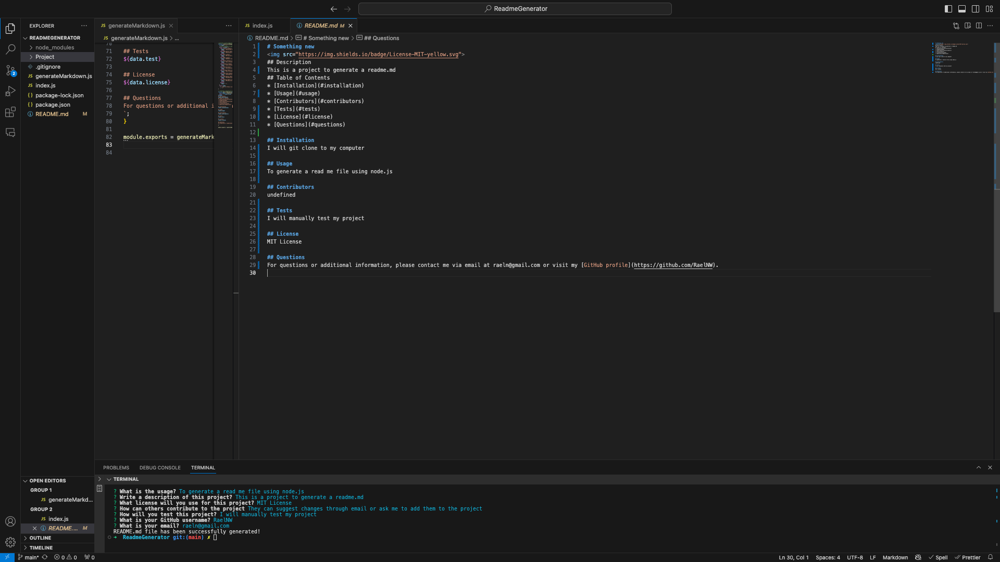

# SomethingNew

## Description
The project is to help me generate areadme.md using prompts
## Table of Contents
* [Installation](#installation)
* [Usage](#usage)
* [Contributors](#contributors)
* [Tests](#tests)
* [License](#license)
* [Screenshot](#screenshot)
* [Questions](#questions)

## Installation
I will clone the repo to my directory

## Usage
This is to generate a readme.md

## Contributors
undefined

## Tests
I will manually test the project

## License
MIT License

## Screenshot

## Questions
For questions or additional information, please contact me via email at raeln@gmail.com or visit my [GitHub profile](https://github.com/RaelNW).
